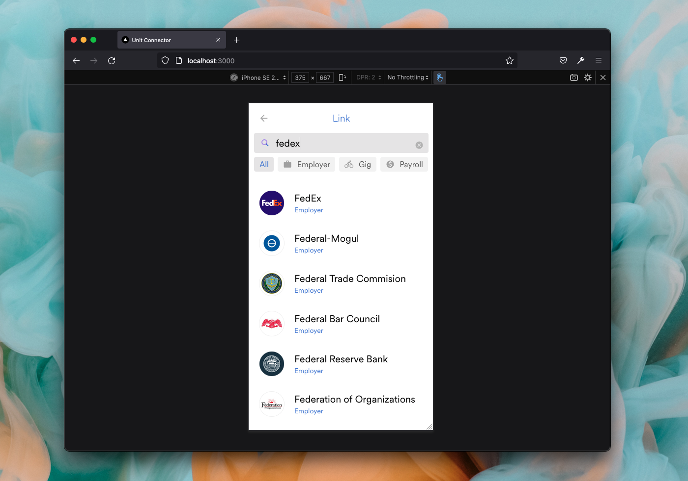

This example showcases how to utilize services provided by [Unit](https://www.unit.co/) to generate account and routing numbers for deposit switching and maintain a mapping of Argyle account IDs against bank routing & account numbers.

It features the following:

- A user connects their employer account via Argyle Link.
- Employment data is retrieved via the Argyle API for loan decisioning.
- A custom endpoint is provided which allows you to initiate a pay distribution change after approving a loan.
- A new Deposit Account with account and routing numbers is generated via Unit API.
- A new pay distribution config with the generated Deposit Account is created and assigned to user’s account.

## Tech stack

This is a [Next.js](https://nextjs.org/) project bootstrapped with [`create-next-app`](https://github.com/vercel/next.js/tree/canary/packages/create-next-app). It uses Prisma to create SQLite database which can be found in `./prisma/dev.db`.

## Prerequisites

- [Argyle Account](https://console.argyle.com/sign-up)
- [Unit Account](https://www.unit.co/)

## Getting Started

### 0. Set environment variables

Create a new `.env.local` file in the root directory and copy the contents of `/env.example`. Fill the values with keys obtained from [Argyle Console](https://console.argyle.com/api-keys) and [Unit](https://app.s.unit.sh/api-tokens)

### 1. Install dependencies for this project:

```bash
npm install
```

### 2. Setup the database

We are using Prisma to set up a local SQLite database.

Run the following command to create your SQLite database file. This also creates `User`, `Account` and `DepositeAccount` tables that are defined in `prisma/schema.prisma`.

```bash
npx prisma migrate dev --name init
```

A fresh SQLite database should be created in `prisma/dev.db`.

### 3. Run the development server:

```bash
npm run dev
# or
yarn dev
```

Open [http://localhost:3000](http://localhost:3000) with your browser to see the result.

You can start editing the page by modifying `pages/index.js`. The page auto-updates as you edit the file.

The `pages/api` directory is mapped to `/api/*`. Files in this directory are treated as [API routes](https://nextjs.org/docs/api-routes/introduction) instead of React pages.

## Demo

### A user connects their employer account via Argyle Link





### Employment data is retrieved via the Argyle API for loan decisioning


### A custom endpoint is provided which allows you to initiate pay distribution change after approving a loan


### A new Deposit Account with account and routing number is generated via Unit API


### A new pay distribution config with the generated Deposit Account is created and assigned to user’s account.


### New Deposit Account should appear in the Unit dashboard


## REST API

REST API is running on the same host machine and port and can be accessed via the `/api` route.

### `GET`

- `/api/account/:id` - fetch a single account by its `id`. Used in Argyle Link initialization, to check if the connected account contains a Pay Distribution config.

### `POST`

- `/api/user` - create a new user

Request body:

```json
{
  "id": "USER_ID",
  "token": "USER_TOKEN"
}
```

- `/api/account` - connect a new account

Request body:

```json
{
  "id": "ACCOUNT_ID",
  "userID": "USER_ID",
  "linkItemId": "LINK_ITEM_ID"
}
```

- `/api/approve/:id` - approve an account for deposit switching. This endpoint handles generating new `DepositAccount` with Unit, uses it to create a new Pay Distribution config and saves the encrypted config to the database.

## Learn More

To learn more about Argyle, take a look at the following resources:

- [Next.js Documentation](https://nextjs.org/docs) - learn about Next.js features and API.
- [Argyle Docs](https://argyle.com/docs) - learn about Argyle integration
- [Unit Docs](https://docs.unit.co/) - learn about Unit API
